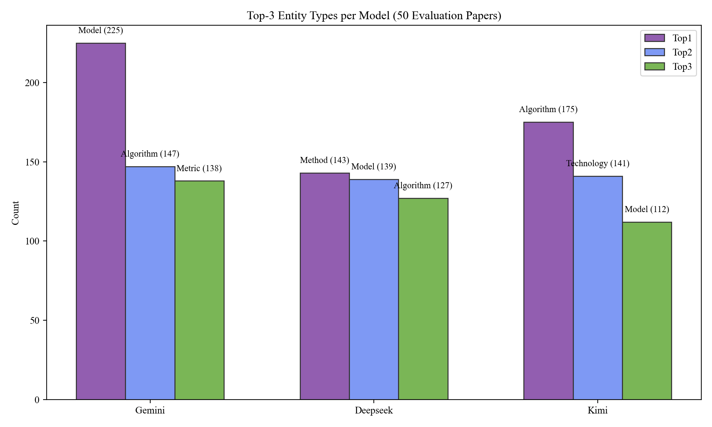

# Top-3 Entity Types per Model (50 Evaluation Papers)

- Evaluation Papers: 50

## Gemini

Rank | Type | Count

---|---|---

Top1 | 模型 | 225

Top2 | 算法 | 147

Top3 | 性能指标 | 138

## Deepseek

Rank | Type | Count

---|---|---

Top1 | 方法 | 143

Top2 | 模型 | 139

Top3 | 算法 | 127

## Kimi

Rank | Type | Count

---|---|---

Top1 | 算法 | 175

Top2 | 技术 | 141

Top3 | 模型 | 112

