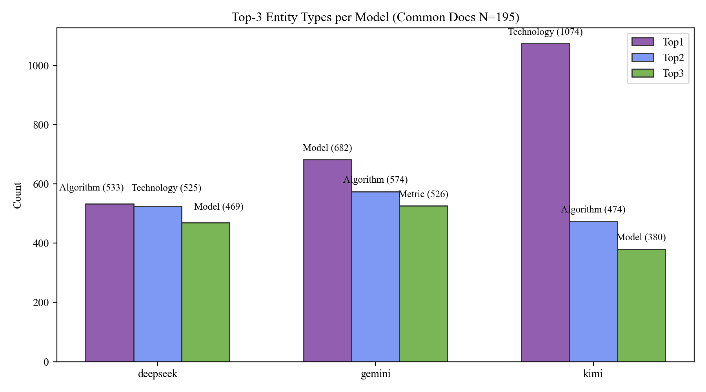

# Top-3 Entity Types per Model

- Common docs: 195

## deepseek

Rank | Type | Count

---|---|---

Top1 | 算法 | 533

Top2 | 技术 | 525

Top3 | 模型 | 469

## gemini

Rank | Type | Count

---|---|---

Top1 | 模型 | 682

Top2 | 算法 | 574

Top3 | 性能指标 | 526

## kimi

Rank | Type | Count

---|---|---

Top1 | 技术 | 1074

Top2 | 算法 | 474

Top3 | 模型 | 380

